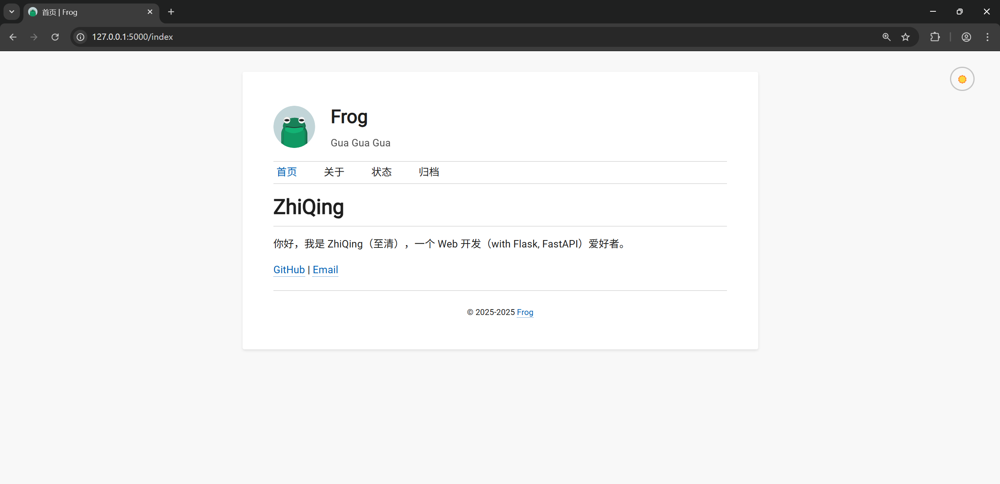
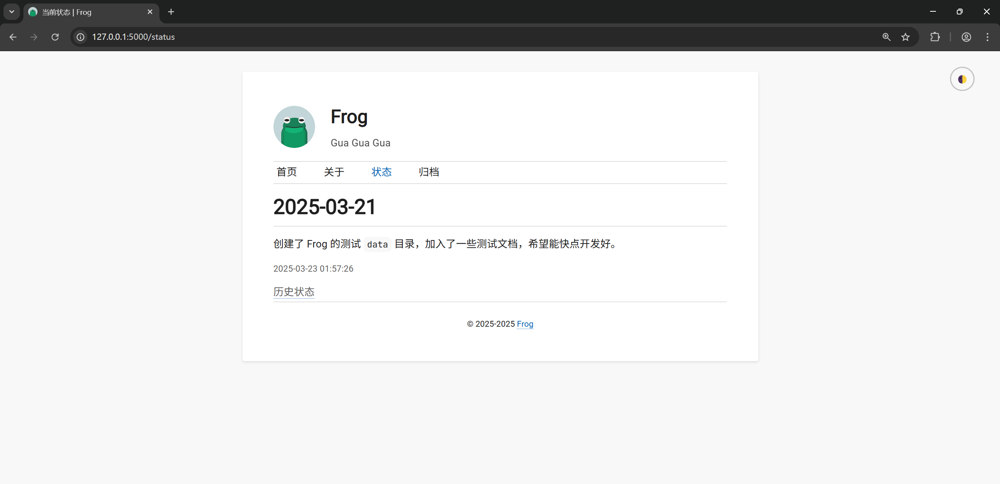
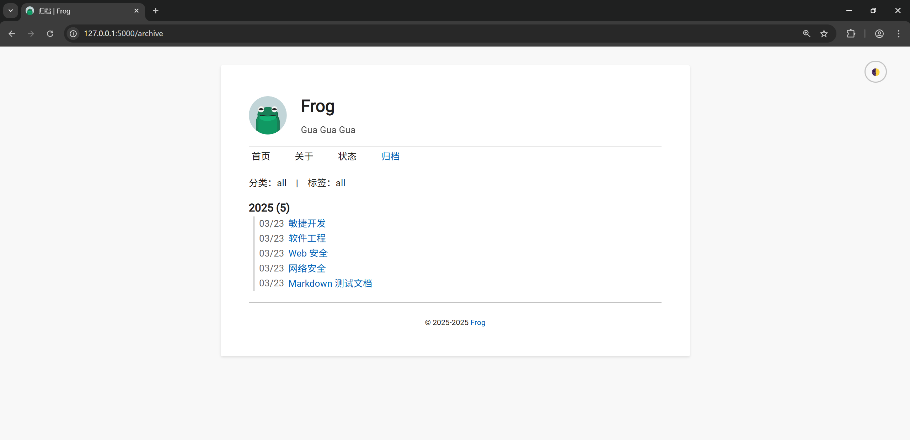
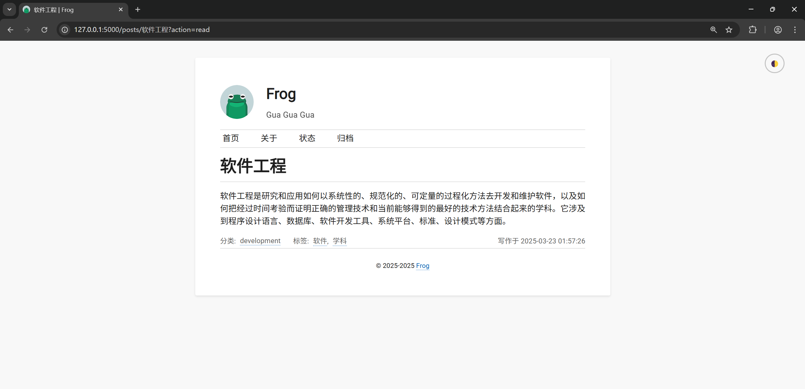
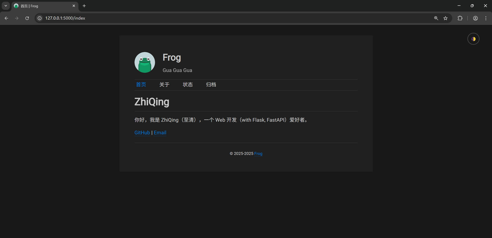

# Frog


一个基于 Flask 的，简洁的个人博客。在文本编辑器编写 Markdown 文档，Frog 会自动解析目录结构和 Markdown 文档生成博客页面。

> [!WARNING]
> 目前本项目处于开发阶段，仅完成了基本功能，还有很多功能待完善。

## 运行

```bash
git clone https://github.com/GitZhiQing/Frog.git
cd Frog
uv sync # 本项目基于 uv 管理依赖包
# 在 data 目录下放入 markdown 文档
flask init # 初始化数据库
flask run # 启动开发服务器
```

## 效果







## 待办

- [x] 分类
- [x] 标签
- [ ] 评论
- [ ] 搜索
- [ ] RSS

## 参考

布局参考 [Twenty Twelve | WordPress Theme](https://wordpress.org/themes/twentytwelve/)，配色参考 VSCode 默认主题。
