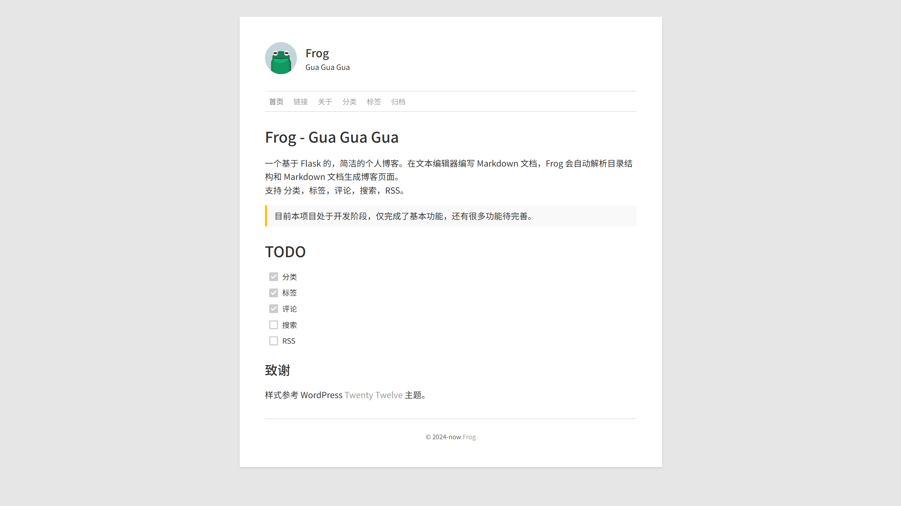
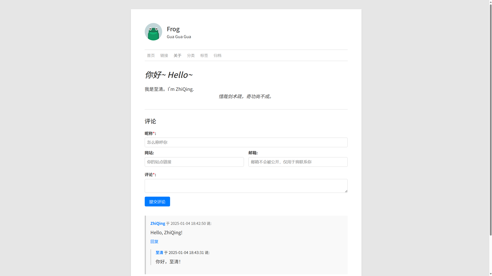

# Frog

简体中文 | [English](README.en.md)

一个基于 Flask 的，简洁的个人博客。在文本编辑器编写 Markdown 文档，Frog 会自动解析目录结构和 Markdown 文档生成博客页面。

支持 分类，标签，评论，搜索，RSS。

> [!WARNING]
> 目前本项目处于开发阶段，仅完成了基本功能，还有很多功能待完善。





## 运行

```bash
> git clone https://github.com/GitZhiQing/Frog.git
> cd Frog
> uv sync # uv 安装依赖
> flask initdb # 初始化数据库
> flask run
```

> 目前本项目还未完成基于 github webhook 的自动更新文档功能，所以你需要手动将你的文档放到 `data/docs` 目录下。

## 进度

- [x] 分类
- [x] 标签
- [x] 评论
- [ ] 搜索
- [ ] RSS
- [ ] GitHub Webhook 自动更新文档

## 致谢

整体样式参考 WordPress [Twenty Twelve](https://wordpress.org/themes/twentytwelve/) 主题。

字体：

- 中文：[Noto Sans SC](https://fonts.google.com/specimen/Noto+Sans+SC)
- 英文：[Roboto](https://fonts.google.com/specimen/Roboto)
- 等宽：[JetBrains Mono](https://fonts.google.com/specimen/JetBrains+Mono)
