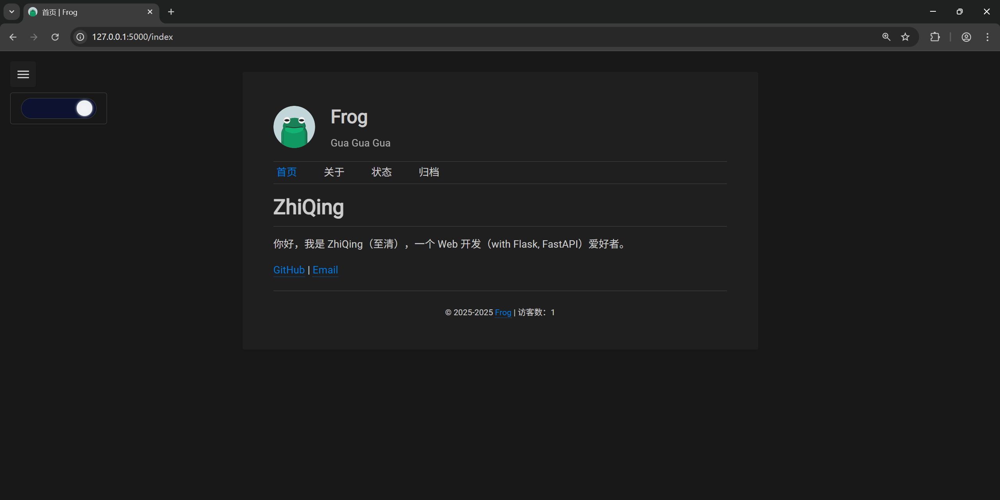

# Frog

一个基于 Flask 的，简洁的个人博客。在文本编辑器编写 Markdown 文档，Frog 会自动解析目录结构和 Markdown 文档生成博客页面。

[我的博客](https://blog.qlear.top)

## 运行

```bash
git clone https://github.com/GitZhiQing/Frog.git && cd Frog
```

本项目基于 uv 管理依赖包，运行 `uv sync` 将自动创建虚拟环境并根据 `uv.lock` 文件安装依赖。

```bash
uv sync
```

在 data 目录下放入 markdown 文档，然后运行 `flask init --all` 初始化数据库。

当你更新文档时，运行 `flask init`，评论等其他数据不会被影响。

```
flask init --all
```

在项目根目录创建 `.env` 文件，写入配置内容：

```
SERVER_NAME=<web_server_name>       # 服务器 host:port, eg: 127.0.0.1:5000, blog.example.com
BLOG_NAME=<blog_name>               # 博客名称, 显示在博客页面顶部
BLOG_INTRO=<blog_intro>             # 博客介绍, 显示在博客页面顶部
SECRET_KEY=<secret_key>             # Flask 密钥
ADMIN_EMAIL=<admin_email>           # 管理员邮箱, 将用于系统邮件通知
REDIS_HOST=redis                    # redis 服务器地址, 一般不需要修改
REDIS_PASSWORD=<redis_password>     # redis 密码, 请注意和 compose.yml 中 redis_password 保持一致
MAIL_SENDER_NAME=<mail_sender_name> # 发件人名称
MAIL_SENDER_ADDRESS=<mail_sender_address> # 发件人地址 eg: example@example.com
MAIL_SERVER=<mail_server>           # SMTP 服务器地址 eg: smtp.example.com
MAIL_USERNAME=<mail_username>       # 发件人用户名 eg: example@example.com
MAIL_PASSWORD=<mail_password>       # 发件人密码
```

## 效果





## 待办

- [x] 分类
- [x] 标签
- [x] 评论
- [ ] 搜索
- [ ] 优化分类，标签搜索
- [ ] 允许用户订阅评论回复
- [ ] 优化访问数统计逻辑

## 参考

布局直接参考了 [李辉大佬的博客](https://greyli.com/)，该博客使用 [Twenty Twelve | WordPress Theme](https://wordpress.org/themes/twentytwelve/)。

配色参考 VSCode 默认主题。

字体 [Roboto](https://fonts.google.com/specimen/Roboto)，[Noto Sans SC](https://fonts.google.com/noto/specimen/Noto+Sans+SC)。
