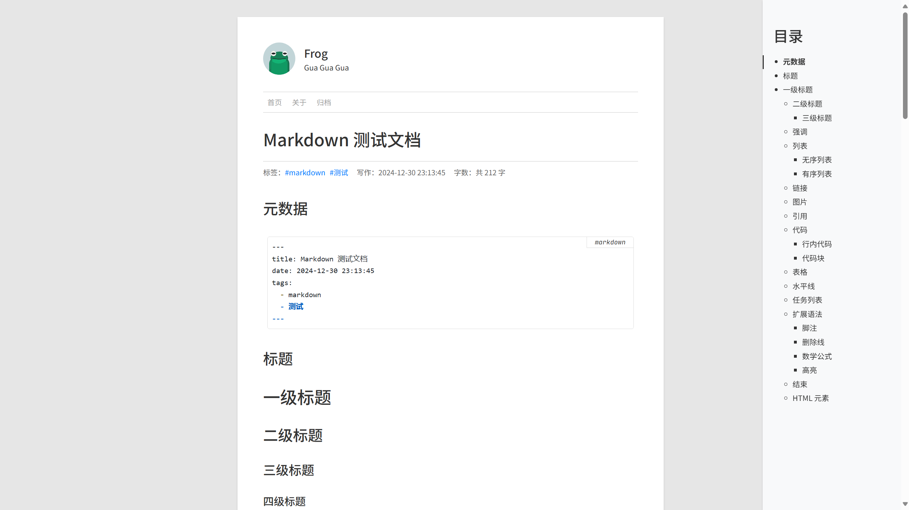

一个基于 Flask 的，简洁的个人博客。在文本编辑器编写 Markdown 文档，Frog 会自动解析目录结构和 Markdown 文档生成博客页面。

> [!WARNING]
> 目前本项目处于开发阶段，仅完成了基本功能，还有很多功能待完善。

## 致谢

样式参考 WordPress [Twenty Twelve](https://wordpress.org/themes/twentytwelve/) 主题。
